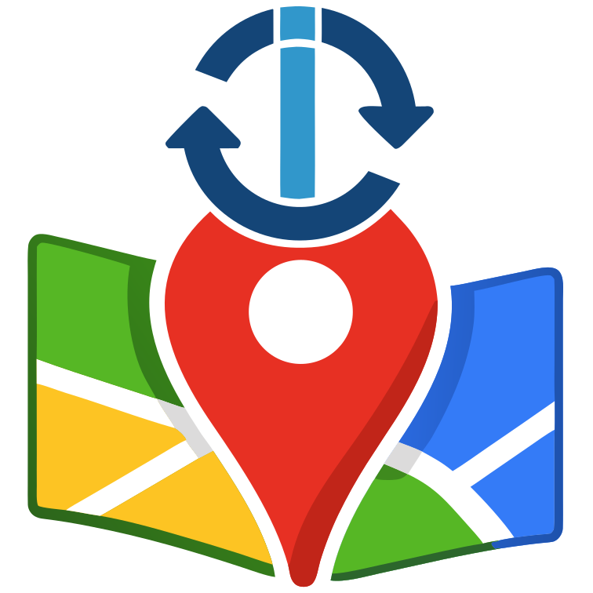

# ioBroker.google-sharedlocations2

**Tests:** 

## google-sharedlocations2 adapter for ioBroker

Share your location with ioBroker via Google Maps. You should create a separate Google account for this purpose, i.e. an account for your ioBroker installation. Do NOT use your personal account.

In config, enter the credentials of the Google account you created for ioBroker. Do **NOT** enter your **personal** account data. Then share your location from your mobile device (and account) with this account. The adapter will read the shared location and create states in ioBroker for each person sharing their location with the Google account.
You can configure the polling interval. But it will ignore values below 1 minute to avoid being blocked by Google.

This is not associated with Google in any way. Usage of this adapter might violate Google's Terms of Service. Use at your own risk.

Copyright and trademark of Google are property of Google.

## Changelog
<!--
    Placeholder for the next version (at the beginning of the line):
    ### **WORK IN PROGRESS**
-->
### 0.0.2 (2026-01-28)
* (Garfonso) store password encrypted

## License
MIT License

Copyright (c) 2026 Garfonso <garfonso@mobo.info>

Permission is hereby granted, free of charge, to any person obtaining a copy
of this software and associated documentation files (the "Software"), to deal
in the Software without restriction, including without limitation the rights
to use, copy, modify, merge, publish, distribute, sublicense, and/or sell
copies of the Software, and to permit persons to whom the Software is
furnished to do so, subject to the following conditions:

The above copyright notice and this permission notice shall be included in all
copies or substantial portions of the Software.

THE SOFTWARE IS PROVIDED "AS IS", WITHOUT WARRANTY OF ANY KIND, EXPRESS OR
IMPLIED, INCLUDING BUT NOT LIMITED TO THE WARRANTIES OF MERCHANTABILITY,
FITNESS FOR A PARTICULAR PURPOSE AND NONINFRINGEMENT. IN NO EVENT SHALL THE
AUTHORS OR COPYRIGHT HOLDERS BE LIABLE FOR ANY CLAIM, DAMAGES OR OTHER
LIABILITY, WHETHER IN AN ACTION OF CONTRACT, TORT OR OTHERWISE, ARISING FROM,
OUT OF OR IN CONNECTION WITH THE SOFTWARE OR THE USE OR OTHER DEALINGS IN THE
SOFTWARE.